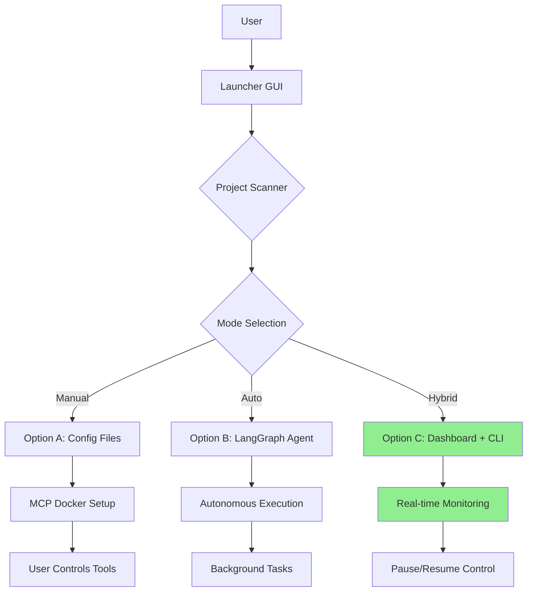
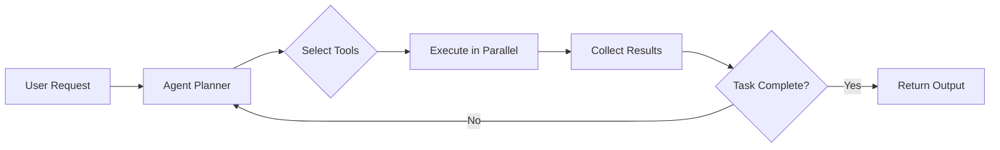
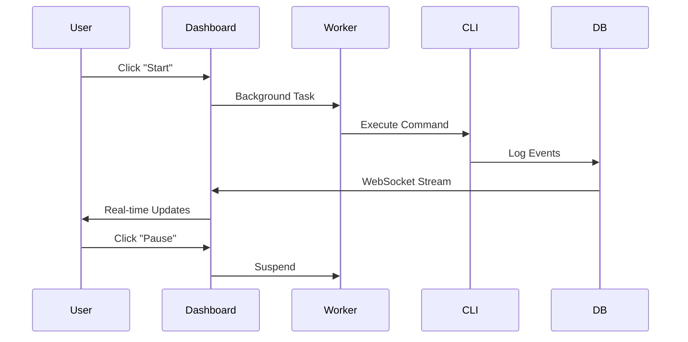

# LLM Boilerplate Pack - Project Context

## Project Overview

**LLM Boilerplate Pack** is a modular AI coding agent framework that provides three operational modes for different use cases. The framework focuses on safe injection into existing projects via a `.agent-booster/` subdirectory, preventing conflicts with existing code.

## Architecture

### High-Level Flow



### Directory Structure

```
boilerplate/
├── .agent/                    # Antigravity configuration
│   ├── rules.md              # Project-specific rules
│   ├── context.md            # This file
│   └── workflows/            # Custom workflows
│
├── kits/                     # Injection packages
│   ├── common/               # Shared utilities
│   │   ├── __init__.py
│   │   └── injection.py      # Core injection logic
│   │
│   ├── option_a/             # Manual Mode
│   │   ├── INSTRUCTIONS.md
│   │   ├── docker-compose.yml
│   │   └── .env.template
│   │
│   ├── option_b/             # Full Auto Mode
│   │   ├── INSTRUCTIONS.md
│   │   ├── agent.py          # LangGraph ReAct agent
│   │   ├── graph.py          # Agent graph definition
│   │   └── tools/            # MCP tool wrappers
│   │
│   └── option_c/             # Hybrid Mode
│       ├── INSTRUCTIONS.md
│       ├── mock_agent.py     # Testing agent
│       ├── mock_agent.sh     # Shell wrapper
│       └── runtime/          # Dashboard server
│           ├── app.py        # FastAPI server
│           ├── static/       # Frontend assets
│           └── templates/    # HTML templates
│
├── langchain_tools/          # Core libraries
│   └── core/
│       ├── logging.py        # StructuredLogger
│       ├── git.py           # GitWorkflowTool
│       ├── cli_worker.py    # CLI execution wrapper
│       └── mcp_client.py    # MCP server client
│
├── launcher/                 # GUI injection interface
│   ├── app.py               # FastAPI server
│   ├── scanner.py           # Project analysis
│   └── templates/           # Web UI
│
├── mcp/                     # MCP server configurations
│   ├── docker-compose.mcp.yml
│   ├── mcp-docker-runner.js  # Docker bridge
│   ├── serena.Dockerfile
│   ├── codanna.Dockerfile
│   └── shrimp.Dockerfile
│
└── docs/                    # Documentation
    ├── architecture.md
    └── api_reference.md
```

## Core Components

### 1. Launcher (Port 8000)

**Purpose**: Web-based GUI for scanning projects and injecting boilerplate

**Key Files**:
- `launcher/app.py` - FastAPI server
- `launcher/scanner.py` - Analyzes project structure and recommends mode

**Workflow**:
1. User enters target project path
2. Scanner analyzes project complexity
3. Recommends optimal mode (A/B/C)
4. User confirms and injects selected kit
5. Files copied to `<target-project>/.agent-booster/`

### 2. Mode Implementations

#### Option A: Manual Mode
**Use Case**: Experienced users who want full control

**Components**:
- MCP server Docker Compose configuration
- Environment variable templates
- Git workflow integration guides

**User Flow**:
1. Inject config files
2. Manually start MCP servers via Docker
3. Use preferred CLI/IDE tools
4. Reference MCP endpoints in tools

#### Option B: Full Auto Mode
**Use Case**: Rapid prototyping, autonomous task execution

**Key Technologies**:
- LangGraph for agent orchestration
- ReAct pattern for reasoning
- Background task execution
- Parallel tool execution

**Components**:
- `agent.py` - Main agent logic
- `graph.py` - LangGraph state machine
- `tools/` - MCP tool wrappers

**Execution Flow**:


#### Option C: Hybrid Mode (Recommended)
**Use Case**: Balance automation with user oversight

**Key Features**:
- Real-time Dashboard (Port 8001)
- WebSocket log streaming
- Pause/Resume execution control
- Git workflow automation
- SQLite logging backend

**Components**:
- `runtime/app.py` - FastAPI + WebSocket server
- `runtime/static/` - Dashboard frontend (HTML/JS/CSS)
- `cli_worker.py` - CLI execution wrapper
- `logging.py` - Structured logging to SQLite

**Data Flow**:


### 3. Logging System

**Implementation**: `langchain_tools/core/logging.py`

**Features**:
- Structured JSON logging
- SQLite backend (`.logs/events.db`)
- Real-time WebSocket streaming
- Color-coded console output

**Schema**:
```python
{
    "id": "uuid",
    "timestamp": "ISO8601",
    "level": "INFO|DEBUG|WARNING|ERROR",
    "component": "launcher|agent|dashboard",
    "task_id": "optional_task_uuid",
    "message": "Human-readable message",
    "metadata": {"key": "value"}
}
```

### 4. MCP Server Integration

**Available Servers**:

| Server | Language | Purpose | Port |
|--------|----------|---------|------|
| Serena | Python (uv) | Code analysis, suggestions | N/A |
| Codanna | Rust | Code intelligence, refactoring | 8081 |
| Shrimp | Node.js | Task management | N/A |
| Context7 | Node.js | Semantic search, context retrieval | 8080 |

**Connection Methods**:
1. **Docker** (Recommended): `mcp-docker-runner.js` manages containers
2. **Direct**: Run servers locally, connect via stdio/HTTP

**Configuration**:
- `mcp/docker-compose.mcp.yml` - Service definitions
- `.env.mcp` - API keys and environment variables
- `mcp_config.json` - Antigravity MCP configuration

### 5. Git Workflow

**Implementation**: `langchain_tools/core/git.py`

**Features**:
- Auto-create feature branches
- Descriptive commit messages
- Status tracking
- Respects `.gitignore`

**Defaults**:
- Branch prefix: `feature/ai-task-`
- Auto-commit: Enabled in Option B/C
- Auto-push: Disabled (requires user confirmation)

## Mode Comparison Matrix

| Feature | Option A | Option B | Option C |
|---------|----------|----------|----------|
| **Control Level** | Full Manual | Autonomous | Hybrid |
| **API Keys Required** | No | Yes | Optional |
| **Dashboard** | No | No | Yes (Port 8001) |
| **Git Automation** | Manual | Auto | Auto (with pause) |
| **Learning Curve** | Low | High | Medium |
| **Best For** | Experts | Rapid prototyping | Most users |
| **Pause/Resume** | N/A | No | Yes ✅ |
| **Real-time Logs** | No | No | Yes ✅ |

## Environment Configuration

### Core Variables (All Modes)
```bash
PROJECT_NAME="my_project"
PROJECT_MODE="option_c"  # a, b, or c
LOG_DB_PATH=".logs/events.db"
LOG_LEVEL="INFO"
```

### Mode-Specific Variables

**Option B (Full Auto)**:
```bash
ANTHROPIC_API_KEY="sk-ant-..."
OPENAI_API_KEY="sk-..."
TAVILY_API_KEY="tvly-..."
```

**Option C (Hybrid)**:
```bash
CLI_COMMAND_PATH="path/to/claude"  # or "mock" for testing
CLI_TIMEOUT=600
GIT_BRANCH_PREFIX="feature/ai-task-"
DASHBOARD_PORT=8001
```

**MCP Servers**:
```bash
CONTEXT7_API_KEY="ctx7-..."
MCP_DOCKER_HOST="localhost"
MCP_CONTEXT_PORT=8080
MCP_CODANNA_PORT=8081
```

## Port Usage Summary

| Port | Service | Mode |
|------|---------|------|
| 8000 | Launcher GUI | All |
| 8001 | Dashboard | Option C |
| 8080 | Context7 MCP | All |
| 8081 | Codanna MCP | All |

## Security Considerations

1. **Injection Safety**: All files go to `.agent-booster/` subdirectory
2. **Git Protection**: `.agent-booster/` automatically added to `.gitignore`
3. **API Key Management**: Use `.env` files, never commit secrets
4. **Path Validation**: Sanitize all user-provided paths
5. **Command Execution**: Validate CLI commands before execution

## Testing Strategy

### Unit Tests
- `tests/test_injection.py` - Injection logic
- `tests/test_logging.py` - Logging functionality
- `tests/test_git.py` - Git operations

### Integration Tests
- `tests/integration/test_option_c.py` - Full Dashboard workflow
- Mock MCP servers for testing
- WebSocket communication tests

### Manual Testing
- Use `mock_agent.py` for Dashboard testing (no API keys needed)
- Verify MCP server connectivity
- Test Git workflow with real repositories

## Common Workflows

### First-Time Setup
1. Install dependencies: `pip install -r requirements.txt`
2. Start Launcher: `python -m launcher.app`
3. Scan target project
4. Select and inject mode

### Running Option C Dashboard
```bash
cd <your-project>/.agent-booster
python -m uvicorn runtime.app:app --host 0.0.0.0 --port 8001
```

### Troubleshooting
- Port conflicts: `lsof -ti:8000 | xargs kill`
- MCP server issues: Check Docker logs
- Dashboard WebSocket: Refresh browser, check `.env` settings

## Extension Points

### Adding New Modes
1. Create `kits/option_d/` directory
2. Implement injection logic in `kits/common/injection.py`
3. Update Launcher scanner recommendations

### Custom MCP Servers
1. Add Dockerfile to `mcp/`
2. Update `docker-compose.mcp.yml`
3. Configure in `mcp_config.json`

### Custom Workflows
1. Create `.agent/workflows/<name>.md`
2. Follow YAML frontmatter format
3. Use `// turbo` for auto-run steps
