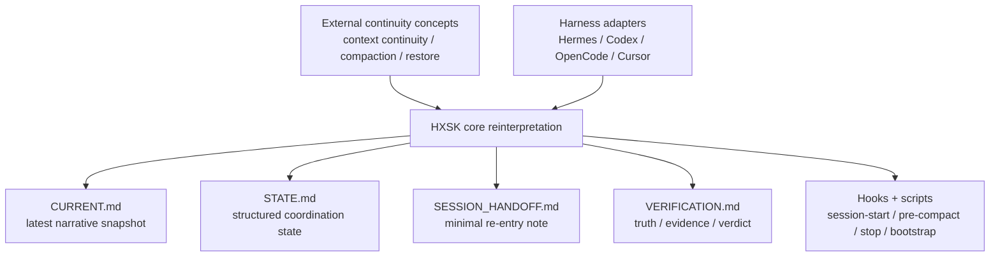
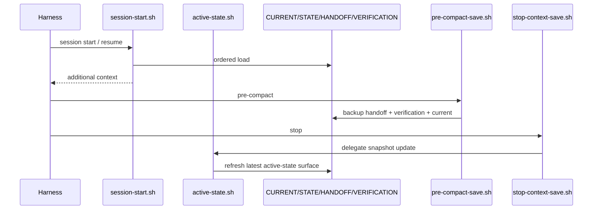

# Harness-Neutral Active-State Spine — 작업 기록

> 목적: HXSK에 Hermes 특화 기능이 아니라 **하네스-중립 active-state spine** 를 core feature로 도입한 작업의 배경, 변경 내용, 검증 결과를 기록합니다.

## 1. 작업 배경

이번 작업은 두 흐름을 합쳐 진행했습니다.

1. **외부 개념 수입**
   - 긴 세션 continuity
   - compaction aftercare
   - hook 기반 상태 복원
   - 원시 출력의 대화창 직접 적재 대신 외부 artifact 사용
2. **HXSK 내부 구조 정렬**
   - `.hxsk/CURRENT.md`
   - `.hxsk/STATE.md`
   - `.hxsk/SESSION_HANDOFF.md`
   - `.hxsk/VERIFICATION.md`

핵심 판단은 다음과 같습니다.

- 이것은 Hermes 연동 기능이 아니라 **HXSK 자체 core feature** 여야 합니다.
- 각 하네스는 이 surface를 읽고 쓰는 **thin bridge** 로 남아야 합니다.
- 병렬 작업은 same-worktree multi-writer가 아니라 **1 branch = 1 worktree = 1 active writer** 규칙으로 다뤄야 합니다.

## 1.1 개념 도식



## 1.2 runtime 흐름 다이어그램



## 2. 참고 문서

- 적용 가능성 검토: [2026-05-04-hermes-working-memory-spine-applicability.md](plans/2026-05-04-hermes-working-memory-spine-applicability.md)
- 구현 로드맵: [2026-05-04-harness-neutral-active-state-spine-roadmap.md](plans/2026-05-04-harness-neutral-active-state-spine-roadmap.md)
- 리서치 요약: [../research/workflow/RESEARCH-harness-neutral-active-state-spine.md](../research/workflow/RESEARCH-harness-neutral-active-state-spine.md)
- Codex 공존 가이드: [../../docs/codex-context-mode-hxsk-coexistence.md](../../docs/codex-context-mode-hxsk-coexistence.md)

## 3. 구현한 변경

### 3.1 core helper 추가
- 신규: `.hxsk/scripts/active-state.sh`

역할:
- canonical active-state surface 존재 보장
- stop 시 latest snapshot 갱신
- runtime snapshot 보관
- `ensure`, `stop`, `status` 엔트리 제공

### 3.2 hook wiring 정합화
수정:
- `.hxsk/hooks/stop-context-save.sh`
- `.hxsk/hooks/session-start.sh`
- `.hxsk/hooks/pre-compact-save.sh`

변경 요점:
- stop 훅이 `CURRENT.md` 단독 갱신에서 `active-state.sh` 위임 구조로 변경
- session-start가 `SESSION_HANDOFF.md → CURRENT.md → STATE.md → VERIFICATION.md` 순서로 재진입 컨텍스트를 로드
- pre-compact가 handoff/verification도 함께 백업

### 3.3 bootstrap / scaffold / verify 반영
수정:
- `.hxsk/hooks/scaffold-hxsk.sh`
- `.hxsk/scripts/bootstrap.sh`
- `.hxsk/scripts/setup-verify.sh`
- `.hxsk/scripts/verify-self-configure.sh`
- `.hxsk/hooks/check-consistency.sh`

변경 요점:
- scaffold가 `SESSION_HANDOFF.md`와 강화된 `STATE.md` stub를 생성
- bootstrap이 canonical active-state surface를 자동 ensure
- setup-verify에 active-state contract 존재 검사 추가
- verify-self-configure 시뮬레이션이 `CURRENT/STATE/SESSION_HANDOFF/VERIFICATION`까지 확인
- consistency check에 active-state contract 섹션 추가

### 3.4 병렬 작업 규율 명시
수정:
- `AGENTS.md`

반영 규칙:
- `1 branch = 1 worktree = 1 active writer`
- same-worktree multi-writer 기본 금지
- `CURRENT.md / SESSION_HANDOFF.md`는 local latest snapshot
- `STATE.md / VERIFICATION.md`는 coordination / integration surface

## 4. 왜 이렇게 설계했는가

### 4.1 context continuity를 문서화 가능한 surface로 고정
긴 세션을 모델 내부 기억에 의존하지 않고, repo-local markdown surface로 복원 가능하게 만들기 위함입니다.

### 4.2 compaction aftercare를 hook 책임으로 이동
compact 전후 상태 유지가 사람 기억에 의존하면 drift가 생깁니다. 따라서 pre-compact / stop / session-start 훅에 책임을 부여했습니다.

### 4.3 thin bridge 원칙 유지
global harness 레이어는 plumbing, HXSK는 meaning/state/verification SSOT를 맡도록 계층을 분리했습니다.

### 4.4 병렬성은 worktree로 확보
same-worktree 병렬 writer는 latest snapshot 성격의 문서와 runtime 로그를 쉽게 오염시킵니다. 따라서 병렬성은 worktree 격리로 확보합니다.

## 5. 검증 결과

실행:

```bash
bash .hxsk/scripts/doc-lint.sh
bash .hxsk/hooks/check-consistency.sh
bash .hxsk/scripts/setup-verify.sh
bash .hxsk/scripts/verify-self-configure.sh --all
bash .hxsk/scripts/local-verify.sh
```

결과:
- `doc-lint.sh` → PASS
- `check-consistency.sh` → PASS
- `setup-verify.sh` → PASS
- `verify-self-configure.sh --all` → PASS
- `local-verify.sh` → pre-PR 단계만 FAIL

해석:
- 기능/문서/검증 contract는 통과
- pre-PR 실패는 현재 브랜치가 `master`인 운영 조건 때문

## 6. 남은 후속 작업

1. feature branch 분기 후 PR-ready closeout
2. adapter 문서를 모두 active-state contract 소비자 관점으로 재정리
3. 필요 시 task-local verification rollup과 root verification 분리 자동화 강화
4. worktree/session namespace를 더 엄격히 분리하는 optional hardening 검토

## 7. 한 줄 요약

HXSK는 이제 Hermes용 부가 연동이 아니라, **긴 세션 continuity / compaction aftercare / 상태 복원을 지원하는 하네스-중립 active-state spine** 을 repo-local core 기능으로 갖추는 방향으로 구체화되었습니다.
