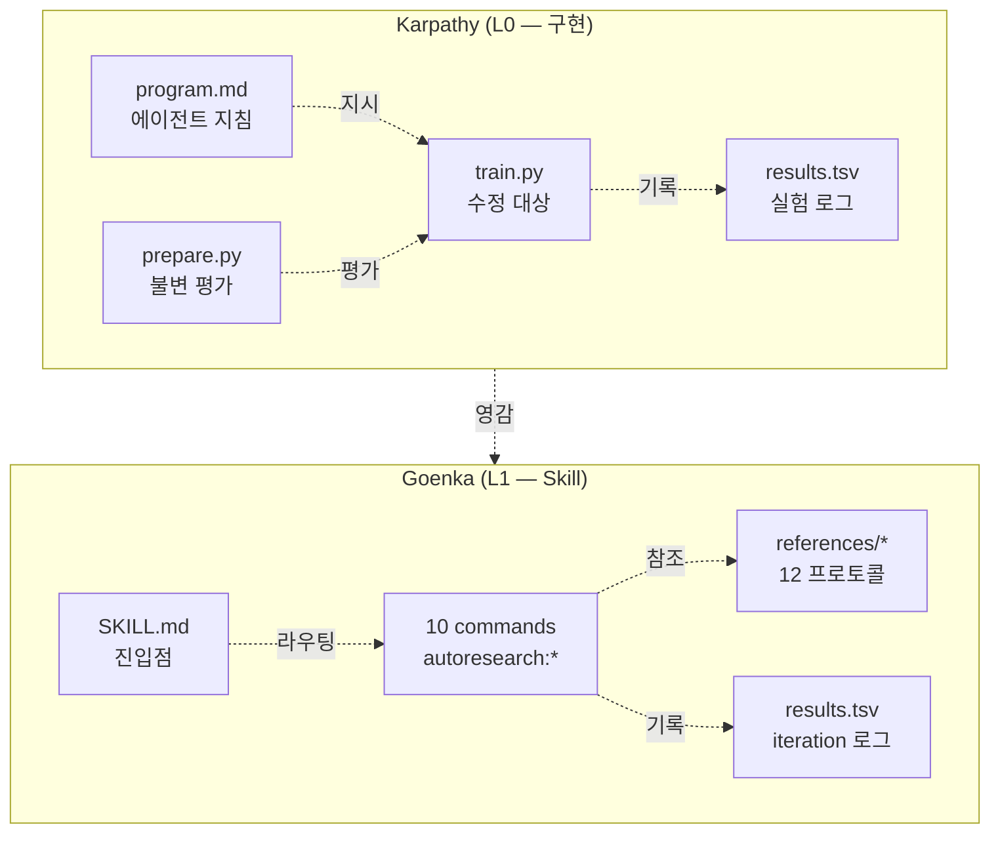

# Autoresearch 방법론 비교 연구

## 1. Executive Summary

`autoresearch`는 Andrej Karpathy가 2026-03-06 공개한 **AI 에이전트가 밤새 스스로 실험을 돌리는 연구 루프**다. 630라인 Python 스크립트 하나로 "한 밤에 100회 실험" 규모의 자율 연구를 보여줬다. 1주 뒤 Udit Goenka가 동일 원칙을 **Claude Code Skill**로 일반화하여 ML에서 벗어나 코드·콘텐츠·마케팅·보안까지 적용 가능하게 만들었다.

두 프로젝트는 "이름은 같으나 층이 다르다":

| 축 | karpathy/autoresearch | uditgoenka/autoresearch |
|----|----------------------|------------------------|
| 층 | **L0 — 데모 구현** | **L1 — Skill 추상화** |
| 대상 | 단일 GPU LLM 훈련 | 임의 도메인 |
| 크기 | 3개 파일 (prepare.py, train.py, program.md) | 10개 커맨드 + 12개 워크플로우 프로토콜 |
| 진입점 | `uv run train.py` | `/autoresearch [:subcommand]` |
| 메트릭 | `val_bpb` 고정 | 커맨드별 구성 (숫자/판정단/체크리스트) |
| 제약 | 하드(prepare.py read-only, 5분 타임박스) | 소프트(Scope glob, Guard 명령) |
| 의존성 | PyTorch + H100 NVIDIA GPU | Claude Code / OpenCode / Codex |

**핵심 통찰**: 두 프로젝트는 하나의 방법론의 두 사례다. 원조가 제공한 것은 "**자율 루프가 작동한다는 증거**"이고, 일반화판이 제공한 것은 "**그 증거를 당신의 도메인에 끼워 넣는 접합부**"다.

## 2. 두 프로젝트 개요

### 2.1 Karpathy (원조)

**철학 선언문** (README에서):
> "Research is now entirely the domain of autonomous swarms of AI agents...
> The agents claim that we are now in the 10,205th generation of the code base."

**핵심 구조**:
```
prepare.py     — constants + data + tokenizer + evaluation (READ-ONLY)
train.py       — model + optimizer + training loop (AGENT MODIFIES)
program.md     — agent instructions (HUMAN MODIFIES)
```

**인간과 에이전트의 노동 분리**:
- 인간은 `program.md`를 편집한다 (전략).
- 에이전트는 `train.py`를 편집한다 (전술).
- `prepare.py`는 누구도 건드리지 않는다 (불변 평가 기준).

이 삼각 구조가 전 방법론의 기반이다.

### 2.2 Goenka (일반화)

**철학 선언문** (README에서):
> "Set the GOAL → The agent runs the LOOP → You wake up to results.
> You don't need AGI. You need a goal, a metric, and a loop that never quits."

**10개 커맨드 풀**:
| 커맨드 | 목적 |
|--------|------|
| `/autoresearch` | 기본 자율 개선 루프 (unbounded) |
| `/autoresearch:plan` | Goal → Scope·Metric·Verify 구성 마법사 |
| `/autoresearch:debug` | 과학적 방법 기반 버그 사냥 루프 |
| `/autoresearch:fix` | 에러 0이 될 때까지 원자 수정 루프 |
| `/autoresearch:security` | STRIDE + OWASP + 4인 레드팀 감사 |
| `/autoresearch:ship` | 8단계 배포 워크플로우 (PR/릴리스/콘텐츠/세일즈/연구) |
| `/autoresearch:scenario` | 12차원 시나리오/엣지케이스 탐색 |
| `/autoresearch:predict` | 5인 전문가 스웜 사전 분석 |
| `/autoresearch:learn` | 코드베이스 스카우트 → 문서 생성/검증 루프 |
| `/autoresearch:reason` | 적대적 정제 (생성→비판→합성→블라인드 판정) |

플러스 직교적 `Iterations: N`(bounded 모드), `Guard: <cmd>`(회귀 방지) 메타 플래그.

## 3. 7가지 핵심 원리 (Karpathy Core Principles)

Goenka가 원조에서 추출한 7원칙은 **방법론의 압축 표현**이다.

### P1. Constraint = Enabler (제약이 가능성이다)

| 원조 | 일반화 |
|------|--------|
| 630라인 코드베이스 | 에이전트 컨텍스트에 들어맞는 제한 범위 |
| 5분 타임박스 | 고정된 반복 비용 |
| 단일 메트릭 `val_bpb` | 단일 기계적 성공 기준 |

**근거**: 제약은 (1) 에이전트가 전체를 이해할 자신감, (2) 모호성 없는 검증, (3) 빠른 피드백 루프를 만든다.

### P2. Strategy ≠ Tactics (인간과 에이전트의 노동 분리)

| 인간 (전략) | 에이전트 (전술) |
|------------|---------------|
| "페이지 로드 속도 개선" | "이미지 lazy-load, 라우트 code-split" |
| "테스트 커버리지 증가" | "uncovered 엣지 테스트 추가" |
| "인증 모듈 리팩토링" | "미들웨어 추출, 핸들러 단순화" |

### P3. Metrics Must Be Mechanical (메트릭은 기계적이어야 한다)

자율 루프의 전제조건. "좋아 보인다/더 깨끗해졌다" 같은 주관적 판단은 **결정 함수의 부재**이며 루프를 죽인다.

허용되는 메트릭:
- exit code (테스트 통과/실패)
- 벤치마크 시간(ms)
- 커버리지 %
- 파일 크기(bytes)
- Lighthouse 점수

**예외 처리**: Goenka의 `/autoresearch:reason`은 "주관적 결정"에 대해 **블라인드 판정단 자체를 메트릭**으로 사용하여 이 원칙을 보존한다. (라벨 랜덤화 → judge bias 차단).

### P4. Fast Verification (검증은 빨라야 한다)

검증이 작업보다 오래 걸리면 인센티브가 틀어진다.
- 허용: 유닛 테스트(초), 타입 체크(초), lint(순간)
- 금지: 풀 E2E(분), 수동 QA(시간)

### P5. Iteration Cost Shapes Behavior (반복 비용이 행동을 결정한다)

- 싼 반복 → 대담한 탐색, 다수 실험
- 비싼 반복 → 보수적, 소수 실험

Karpathy 데모: 5분 × 12 실험/시간 × 8시간 = ~100 실험/밤.

### P6. Git as Memory and Audit Trail (Git이 메모리다)

```
commit 전 → verify → 성공: 유지 / 실패: git reset
```

에이전트는 매 반복마다:
```bash
git log --oneline -20     # 이전 실험 시퀀스
git diff HEAD~1           # 마지막 유지된 변경 분석
git show <hash> --stat    # 특정 커밋 심층 분석
```

이 패턴은 "동일한 실패 반복" 안티패턴을 차단한다 (core-principles.md의 anti-example).

### P7. Honest Limitations (정직한 한계)

Autoresearch가 할 수 없는 것:
- 토크나이저/평가 기준 변경
- 인간 방향 설정 대체
- 의미 있는 개선 보장

**Meta-Principle**:
> *"Autonomy scales when you constrain scope, clarify success, mechanize verification, and let agents optimize tactics while humans optimize strategy."*

## 4. 실행 루프 비교

### 4.1 Karpathy의 루프 (program.md 발췌)

```
LOOP FOREVER:
  1. git state 확인 (현재 브랜치/커밋)
  2. train.py를 실험 아이디어로 직접 수정
  3. git commit
  4. uv run train.py > run.log 2>&1  (파이핑 금지: 컨텍스트 플러딩 방지)
  5. grep "^val_bpb:\|^peak_vram_mb:" run.log
  6. grep 결과 비어있으면 crash → tail -n 50 → 수정 시도 (최대 N회)
  7. results.tsv에 기록 (커밋 안함 — untracked)
  8. val_bpb 개선 → 브랜치 유지 / 아니면 → git reset
```

**NEVER STOP 규칙**:
> "Do NOT pause to ask the human if you should continue. The human might be asleep..."

### 4.2 Goenka의 루프 (README 발췌)

```
LOOP (FOREVER or N times):
  1. 현재 상태 + git 히스토리 + 결과 로그 리뷰
  2. 다음 변경 선택 (작동한 것/실패한 것/미시도 기반)
  3. ONE 집중 변경
  4. Git commit (검증 전)
  5. 기계적 검증 실행 (테스트/벤치/점수)
  6. 개선 → keep / 악화 → git revert / 크래시 → fix or skip
  7. 결과 로그
  8. 반복. 인터럽트 또는 N회 완료 전까지 정지 금지
```

**차이점**:
- Karpathy: `git reset` (HEAD 이동) → 실패 커밋이 히스토리에서 사라짐
- Goenka: `git revert` (역커밋) → **실패도 히스토리에 보존**

Goenka는 이를 명시적으로 "Git is memory" 원칙의 확장으로 설명한다 — **실패 실험도 미래 에이전트가 학습할 자원**이다.

## 5. 아키텍처 비교



### 5.1 Karpathy 아키텍처의 특징

- **Fortran 스타일의 단일 파일 명확성**: train.py 하나. 에이전트 컨텍스트 우려 없음.
- **Immutable harness**: prepare.py는 손댈 수 없다 → 실험 간 비교 가능성 보장.
- **Metric extraction via grep**: 구조화된 stdout(`val_bpb: 0.9979`) + grep 한 줄 = 기계적 메트릭.

### 5.2 Goenka 아키텍처의 특징

- **Skill + Commands 이중 레이어**: SKILL.md는 메인 진입점, `commands/autoresearch:*.md`는 각 도메인 워크플로우.
- **References 프로토콜 분리**: 12개 프로토콜 파일(debug-workflow.md, fix-workflow.md, ...) → 각 커맨드별 수백 줄 지침.
- **멀티 플랫폼 어댑터**: `claude-plugin/`, `.opencode/`, `.agents/` 세 디렉토리로 플랫폼별 포팅 (sync-opencode.sh, sync-codex.sh 스크립트로 파생).

## 6. 메트릭/검증 모델 확장

Karpathy의 단일 숫자 메트릭을 Goenka가 어떻게 일반화했는가:

| 도메인 | 메트릭 예시 | 검증 커맨드 |
|--------|------------|------------|
| ML (원조) | val_bpb | `grep "^val_bpb:" run.log` |
| 테스트 커버리지 | `%` | `npm test --coverage \| grep "All files"` |
| API 지연 | p95 ms | `npm run bench:api \| grep "p95"` |
| 번들 크기 | bytes | `wc -c dist/bundle.js` |
| 버그 수 (`:debug`) | 발견된 고유 버그 | 분류 카운트 + code evidence |
| 시나리오 커버리지 (`:scenario`) | 12차원 × N시나리오 | dimension coverage % |
| 보안 등급 (`:security`) | STRIDE 위협 카운트 | severity × count |
| 문서 건강 (`:learn`) | validation_score × 0.5 + coverage × 0.3 + size × 0.2 | `validate-docs.cjs` |
| 주관적 결정 (`:reason`) | **블라인드 판정단 wins** | N라운드 × M판정 |

`Guard:` 플래그는 이중 게이트를 강제한다:
```
Verify: npm run bench:api | grep "p95"   # "메트릭 개선?"
Guard:  npm test                          # "다른 것이 깨지지 않음?"
```
메트릭은 개선했으나 Guard가 실패 → 2회까지 재작업 후 revert.

## 7. HXSK 적용 가능성 분석

HXSK(현 리포)는 이미 다음 원칙들을 가진다:

| HXSK 기존 | Autoresearch 대응 |
|-----------|-----------------|
| `ATOMIC COMMIT` (AGENTS.md) | P6. Git as Memory |
| `NO COMPLETION WITHOUT VERIFICATION` (CLAUDE.md) | P3+P4. Mechanical + Fast |
| `empirical-validation` skill | P3. Metric must be mechanical |
| `dispatcher` skill (5+ 병렬 태스크) | 원조에 없음 — HXSK 고유 |
| `executor` skill (PLAN.md 기반) | P2. Human strategy → Agent tactics |
| `memory-protocol` + lessons-learned | P6 확장: 단기=Git, 장기=파일 메모리 |

**흡수 가능한 기법 (미구현 3가지)**:

### A. 자동 Revert 루프 (가장 즉시 가치)
현재 HXSK는 "검증 실패 시 사용자에게 보고"만 한다. Goenka의 `/autoresearch:fix` 패턴 채용 시:
```
에러 감지 → 1개 수정 커밋 → verify → 악화 → 자동 revert → 재시도
```
적용 포인트: `executor` skill에 "atomic-retry-revert" 하위 패턴 추가.

### B. TSV Iteration 로그
현재 HXSK는 PR 기반 로그(`.hxsk/memories/lessons-learned/`). TSV 추가 시 **시계열 메트릭 추적** 가능:
```tsv
iteration  commit   metric  delta  status    description
0          a1b2c3d  72.0    0.0    baseline  initial
1          b2c3d4e  74.5    +2.5   keep      add auth tests
2          -        73.0    -1.5   discard   refactor helpers
```
적용 포인트: `.hxsk/reports/iteration-log.tsv`, executor가 매 태스크 완료 시 append.

### C. Bounded 모드 `Iterations: N`
현재 HXSK는 GATE-based(P1→P2→P3→P4→E0→V0→D0). Goenka의 `Iterations: N`은 직교적 자율 반복 제어:
- GATE = "올바른 순서인가?" (품질)
- Iterations = "몇 번 시도할 것인가?" (예산)

두 축은 합쳐질 수 있다. 예: `GATE-E0 + Iterations: 10` → 실행 단계에서 최대 10회 개선 시도.

**흡수 비권장 (HXSK 철학과 충돌)**:

- ❌ **Unbounded "NEVER STOP"** — HXSK는 Conditional Success 원칙(AGENTS.md) 하에 "결과 확인 후에만 성공 출력"을 강제한다. 밤새 돌리는 자율 루프는 이 원칙과 충돌한다.
- ❌ **10개 커맨드 전수 이식** — HXSK의 skill 집합(`executor`, `planner`, `debugger`, `verifier`, `create-pr`, `pr-review`)은 이미 유사한 커버리지를 제공한다. `:security`, `:predict`, `:reason`만 추가 가치가 있다.

## 8. 핵심 안티패턴 (두 프로젝트 공통)

| 안티패턴 | 왜 위험한가 | 올바른 대안 |
|---------|-----------|-----------|
| 주관적 판정("이게 더 나음") | 결정 함수 부재 → 루프 정지 | 기계적 메트릭 정의 |
| 복수 변경 한 커밋 | 어느 변경이 개선했는지 불명 | One change per iteration |
| 검증 건너뛰기 ("새 코드는 버그 없어") | LLM 환각 → 잘못된 참조 | 생성 후 무조건 검증 |
| 3회 연속 동일 실패 | 같은 벽에 머리 박기 | Goenka: 다른 접근 / HXSK: 3-Strike Rule |
| 검증 명령 자체 편집 | 메트릭 조작 | Guard 파일 항상 read-only |
| 전체 리라이트 | 원자성 상실 | 플래그된 이슈만 수정 (fix-loop) |

## 9. 결론 및 권장

### 9.1 두 프로젝트의 상호 관계
- **Karpathy**: 원리 제시 + ML 도메인 증명 (L0)
- **Goenka**: 원리 추출 + 범용 Skill 추상화 (L1)
- **관계**: 논문 : 구현 프레임워크. 둘 다 필요하다 — 원리 없이 프레임워크는 교조적이고, 프레임워크 없이 원리는 도메인별 재구현을 요구한다.

### 9.2 HXSK에의 권장 액션 (우선순위)

1. **[P0 · 이번 분기]** `.hxsk/reports/iteration-log.tsv` 추가 + `executor` skill 연동. 기존 lessons-learned와 시계열 보완.
2. **[P1 · 차기 분기]** `empirical-validation` skill에 "자동 revert 루프" 하위 패턴 추가. Guard 개념 도입 (verify + guard 이중 게이트).
3. **[P2 · 선택]** `/autoresearch:reason` 스타일 블라인드 판정단 패턴을 `arch-review` skill로 이식 — 주관적 아키텍처 결정에 적용.
4. **[유보]** `Iterations: N` 메타 플래그. GATE와의 직교성 검증 후 결정.

### 9.3 수입 판단 매트릭스

| 기법 | 가치 | 비용 | 충돌 | 판단 |
|------|------|------|------|------|
| 자동 revert 루프 | ★★★ | ★ | 없음 | 수입 |
| TSV iteration 로그 | ★★ | ★ | 없음 | 수입 |
| Guard 이중 게이트 | ★★★ | ★★ | 없음 | 수입 |
| Bounded Iterations | ★★ | ★★ | GATE와 직교성 검증 필요 | 검토 |
| 10개 커맨드 전수 | ★ | ★★★★ | 기존 skill과 중복 | 비수입 |
| Unbounded NEVER STOP | ★ | ★★ | Conditional Success 원칙 | 비수입 |

## 10. 출처

**1차 출처 (원문 인용 가능)**:
- `karpathy/autoresearch` README.md (commit @ 2026-03-26)
- `karpathy/autoresearch/program.md` (원조 에이전트 지침)
- `uditgoenka/autoresearch` README.md (v2.0.0-beta.0.2)
- `uditgoenka/autoresearch/.claude/skills/autoresearch/references/core-principles.md`

**2차 출처 (참조됨)**:
- nanochat: https://github.com/karpathy/nanochat (autoresearch의 상위 프로젝트)
- Karpathy 트윗: x.com/karpathy/status/2029701092347630069, 2031135152349524125

**HXSK 내부 연결**:
- @../.. /../AGENTS.md — ATOMIC COMMIT, NO COMPLETION WITHOUT VERIFICATION
- @../../skills/empirical-validation/SKILL.md — 기계적 검증 원칙
- @../../skills/executor/SKILL.md — PLAN.md 기반 자동 실행
- @../memory-systems/RESEARCH-a-mem-agentic-memory.md — 장기 메모리 설계 (autoresearch의 git-as-memory와 상보적)
