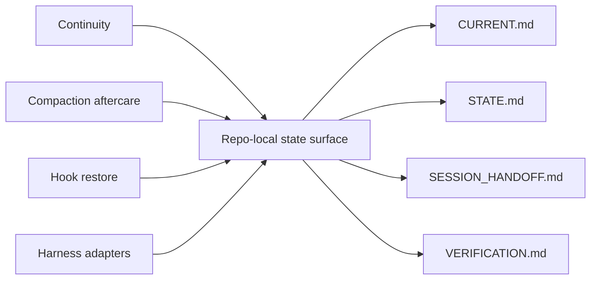
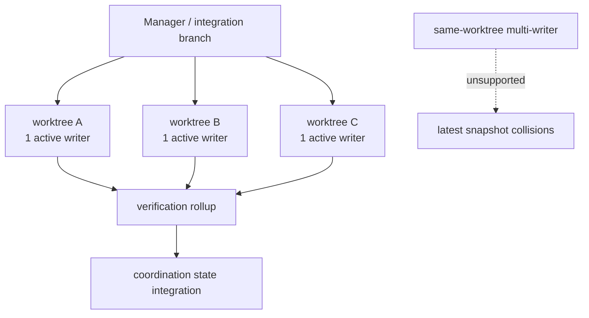

# RESEARCH — Harness-Neutral Active-State Spine

## Status
`active`

## 질문
외부의 context continuity / compaction / hook-based restore 개념을 HXSK에 수입할 때, 이를 특정 하네스(Hermes/Codex)에 묶지 않고 **HXSK core feature** 로 재해석할 수 있는가?

## 짧은 결론
예. HXSK에서는 이를 **Harness-Neutral Active-State Spine** 으로 정의하는 편이 가장 일관됩니다.

- 하네스는 상태를 운반하는 bridge
- HXSK는 상태의 의미와 검증을 보관하는 SSOT
- continuity의 본체는 대화창이 아니라 repo-local surface

## 개념 맵

## 병렬 실행 모델

## 채택한 핵심 개념

### 1. Context saving보다 context loading discipline
문제는 단순 저장이 아니라, 다음 세션이 무엇을 얼마나 읽어야 하는지를 통제하는 것입니다.

HXSK 대응:
- `SESSION_HANDOFF.md` — 최소 재진입 포인터
- `CURRENT.md` — 최신 세션 서사
- `STATE.md` — 구조화 상태
- `VERIFICATION.md` — 검증 truth / evidence / verdict

### 2. Compaction aftercare
compact 자체보다, compact 전후 최소 상태가 무엇인지가 중요합니다.

HXSK 대응:
- `pre-compact-save.sh`에서 snapshot 백업
- `stop-context-save.sh`에서 latest snapshot 갱신
- `session-start.sh`에서 ordered restore

### 3. Code / procedure as compression
대화를 길게 유지하는 대신, 규칙과 절차를 스크립트/스킬/게이트로 외부화합니다.

HXSK 대응:
- `.hxsk/scripts/active-state.sh`
- `.hxsk/hooks/*`
- `.hxsk/skills/*`
- `.hxsk/workflow/GATES.md`

### 4. Thin bridge
전역 하네스 설정은 plumbing layer, HXSK는 semantic layer를 맡습니다.

HXSK 대응:
- Codex context-mode는 전역 continuity plumbing
- HXSK는 repo-local meaning/state/verification contract
- Hermes/OpenCode/Cursor는 동일 surface를 읽는 adapter

### 5. Parallel work as isolated execution slices
병렬성은 같은 디렉터리에서 여러 에이전트가 덮어쓰는 방식이 아니라, worktree 격리 단위로 다뤄야 합니다.

HXSK 대응:
- `1 branch = 1 worktree = 1 active writer`
- same-worktree multi-writer 금지
- integration 단계에서만 coordination surface 갱신

## 설계 판단

### 왜 Hermes feature가 아닌가
Hermes는 메모리, todo, delegation 등 유용한 소비자이지만, HXSK의 canonical source는 어디까지나 repo-local surface입니다. 따라서 HXSK 본체는 특정 런타임과 분리되어야 합니다.

### 왜 STATE와 CURRENT를 분리하는가
- `CURRENT.md`는 사람/에이전트가 읽기 쉬운 최신 서사
- `STATE.md`는 gate/dispatcher/verification이 읽기 쉬운 구조화 상태

둘을 합치면 narrative drift와 machine-readability가 동시에 악화됩니다.

### 왜 SESSION_HANDOFF를 별도 두는가
`CURRENT.md`가 길어질수록 재진입 비용이 커집니다. handoff는 compact 후에도 남겨야 하는 최소 복원 표면이므로 별도 문서가 필요합니다.

## HXSK에 남긴 구현 함의

1. bootstrap/scaffold/self-configure 단계에서 active-state surface를 생성/검증해야 함
2. stop/session-start/pre-compact 훅이 aftercare 책임을 가져야 함
3. consistency 검사가 active-state contract를 포함해야 함
4. adapter 문서는 core contract 소비자 관점으로 재정리되어야 함
5. README와 skills 문서는 이 구조를 공개적으로 설명해야 함

## 관련 구현/계획 문서
- [ACTIVE-STATE-SPINE-IMPLEMENTATION.md](../../docs/ACTIVE-STATE-SPINE-IMPLEMENTATION.md)
- [2026-05-04-harness-neutral-active-state-spine-roadmap.md](../../docs/plans/2026-05-04-harness-neutral-active-state-spine-roadmap.md)
- [2026-05-04-hermes-working-memory-spine-applicability.md](../../docs/plans/2026-05-04-hermes-working-memory-spine-applicability.md)
- [../../../docs/codex-context-mode-hxsk-coexistence.md](../../../docs/codex-context-mode-hxsk-coexistence.md)

## 한 줄 결론
HXSK가 수입한 것은 "Hermes 스타일 기능"이 아니라, **세션 복원과 검증을 repo-local surface에 고정하는 active-state spine 설계 원리** 입니다.
