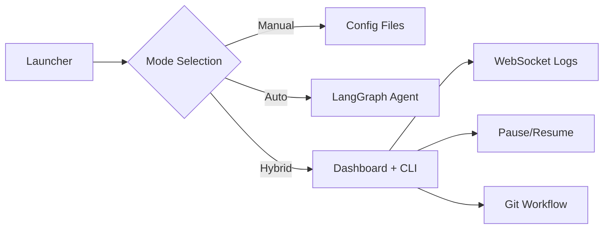

# 🚀 LLM Boilerplate Pack

**모듈식 AI 코딩 에이전트 프레임워크**

세 가지 작동 모드를 제공하는 유연한 보일러플레이트:
- 🛠️ **Option A (Manual)**: 설정 파일만 제공
- 🤖 **Option B (Full Auto)**: LangGraph 기반 완전 자율
- 🎛️ **Option C (Hybrid)**: Dashboard + CLI 하이브리드

---

## ✨ 주요 기능

### 🎯 모드별 특징

#### Option A: Manual Mode
- MCP 서버 Docker 구성
- 환경 변수 템플릿
- Git 워크플로우 통합
- 사용자가 선호하는 도구 사용

#### Option B: Full Auto
- LangGraph ReAct 에이전트
- MCP 도구 자동 실행
- 백그라운드 작업 관리
- 병렬 실행 최적화

#### Option C: Hybrid
- 실시간 Dashboard (WebSocket)
- Pause/Resume 제어
- CLI Worker 통합
- Git 상태 추적

### 🛡️ 안전 설계
- `.agent-booster/` 서브디렉토리에 안전 주입
- 기존 프로젝트 파일과 충돌 없음
- `.gitignore` 자동 추가

---

## 📦 프로젝트 구조

```
boilerplate/
├── kits/               # 주입 가능한 모드별 패키지
│   ├── common/         # 공통 라이브러리
│   ├── option_a/       # Manual Mode
│   ├── option_b/       # Full Auto Mode
│   └── option_c/       # Hybrid Mode
│       ├── runtime/    # Dashboard 서버
│       └── mock_agent.py
├── langchain_tools/    # 핵심 라이브러리
│   └── core/
│       ├── logging.py  # 구조화된 로깅
│       ├── git.py      # Git 워크플로우
│       └── cli_worker.py
├── launcher/           # GUI 선택 인터페이스
│   └── app.py
└── mcp/               # MCP 서버 Docker 설정
```

---

## 🚀 빠른 시작

### 1. Launcher 실행
```bash
cd boilerplate
python -m launcher.app
```

브라우저에서 `http://localhost:8000` 접속

### 2. 프로젝트 스캔
- 대상 프로젝트 경로 입력 (예: `.legacy`)
- "Scan Project" 클릭

### 3. 모드 선택 및 주입
- 추천 모드 확인
- "Inject Selected Kit" 클릭

### 4. 사용
Option C 선택 시:
```bash
# Dashboard 자동 실행 (localhost:8001)
cd your-project/.agent-booster
python -m uvicorn runtime.app:app --port 8001
```

더 자세한 내용은 [QUICKSTART.md](file:///Users/sukbeom/Desktop/workspace/boilerplate/QUICKSTART.md) 참조

---

## 🏗️ 아키텍처

### 핵심 컴포넌트



### 데이터 흐름 (Option C)
1. Dashboard (FastAPI) ← User interaction
2. Background Task → CLI Worker
3. CLI Worker → Mock/Real Agent
4. Agent Output → Structured Logs → SQLite
5. WebSocket → Dashboard UI update

---

## 📚 문서

- [QUICKSTART.md](file:///Users/sukbeom/Desktop/workspace/boilerplate/QUICKSTART.md) - 5분 시작 가이드
- [TROUBLESHOOTING.md](file:///Users/sukbeom/Desktop/workspace/boilerplate/TROUBLESHOOTING.md) - 문제 해결
- [kits/option_a/INSTRUCTIONS.md](file:///Users/sukbeom/Desktop/workspace/boilerplate/kits/option_a/INSTRUCTIONS.md) - Manual Mode 가이드
- [kits/option_b/INSTRUCTIONS.md](file:///Users/sukbeom/Desktop/workspace/boilerplate/kits/option_b/INSTRUCTIONS.md) - Full Auto 가이드

---

## 🤖 Google Antigravity 통합

이 보일러플레이트는 **Google Antigravity**와 완벽하게 통합됩니다!

### Antigravity에서 사용하기

#### 1. 프로젝트 열기
```bash
# Antigravity에서 이 프로젝트 폴더 열기
# .agent/ 설정이 자동으로 인식됩니다
```

#### 2. MCP 서버 (프로젝트 스코프)
Antigravity는 다음 MCP 서버들을 자동으로 인식합니다:

| 서버 | 설명 | 언어 |
|------|------|------|
| **Serena** | Python 코드 분석 및 제안 | Python (uv) |
| **Codanna** | 고성능 코드 인텔리전스 | Rust |
| **Shrimp** | 작업 추적 및 관리 | Node.js |
| **Context7** | 시맨틱 코드 검색 | Node.js (API 키 필요) |

> **중요**: MCP 서버는 **프로젝트별로 구성**됩니다 (전역 설치 아님)
>
> - 각 프로젝트의 `.agent/mcp_config.json`에 설정
> - Antigravity가 프로젝트를 열 때 자동으로 읽음
> - 전역 설정 파일(`~/.gemini/antigravity/mcp_config.json`)은 비워둠

자세한 내용: [.agent/MCP_CONFIG_GUIDE.md](file:///Users/sukbeom/Desktop/workspace/boilerplate/.agent/MCP_CONFIG_GUIDE.md)

#### 3. 커스텀 워크플로우 (Slash 커맨드)
Antigravity에서 다음 명령어를 사용할 수 있습니다:

- `/setup-boilerplate` - 의존성 설치 및 환경 설정
- `/run-option-c` - Hybrid Dashboard 실행
- `/mcp-docker` - MCP 서버 관리

#### 4. GSD 방법론
[Get Shit Done](https://github.com/toonight/get-shit-done-for-antigravity) 방법론 통합:
- `.gsd/SPEC.md` - 프로젝트 명세 (코딩 전 완료 필수)
- `.gsd/STATE.md` - 세션 메모리
- `.gsd/ROADMAP.md` - 마일스톤 추적
- `.gsd/DECISIONS.md` - 아키텍처 결정 기록

더 자세한 내용: [.agent/ANTIGRAVITY_QUICKSTART.md](file:///Users/sukbeom/Desktop/workspace/boilerplate/.agent/ANTIGRAVITY_QUICKSTART.md)

---

## 🔧 요구사항

- Python 3.11+
- Docker & Docker Compose (MCP 서버용)
- Git

---

## 🐛 알려진 이슈

- Python 3.14 + Pydantic v2 호환성 경고 (동작에는 문제 없음)
- 포트 8000/8001 충돌 시 수동 종료 필요

자세한 내용은 [TROUBLESHOOTING.md](file:///Users/sukbeom/Desktop/workspace/boilerplate/TROUBLESHOOTING.md) 참조

---

## 📝 라이선스

MIT License

---

## 🤝 기여

Issue 및 PR 환영합니다!
