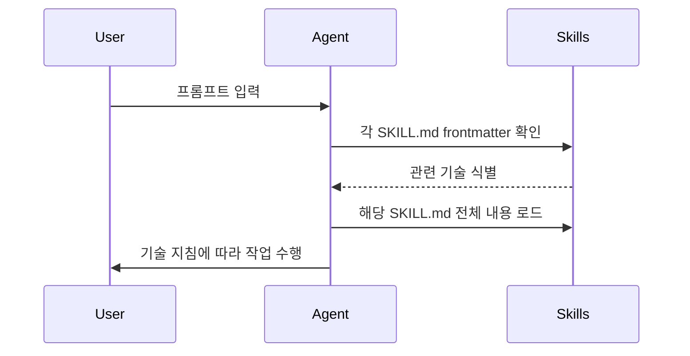

# Antigravity IDE `.agent` 구성 가이드

> **기준**: Google Antigravity 공식 문서 (2026년 2월 기준)
> **작성일**: 2026-02-03

---

## 개요

Google Antigravity는 AI 에이전트 중심의 개발 환경(IDE)으로, `.agent` 폴더를 통해 에이전트의 행동을 커스터마이징할 수 있습니다. 이 가이드는 공식 문서를 기반으로 `.agent` 구성의 핵심 요소를 설명합니다.

---

## 폴더 구조

```text
.agent/
├── rules/                    # 에이전트 행동 규칙
│   ├── coding-standards.md
│   └── testing-policy.md
├── skills/                   # 재사용 가능한 기술 패키지
│   └── code-reviewer/
│       ├── SKILL.md          # 필수 파일
│       ├── scripts/          # 선택: 실행 스크립트
│       ├── references/       # 선택: 참조 문서
│       └── assets/           # 선택: 템플릿, 리소스
└── workflows/                # 워크플로우 정의
    └── deploy.md
```

### 전역(Global) 위치

| 타입 | 워크스페이스 경로 | 전역 경로 |
|------|------------------|-----------|
| **Skills** | `.agent/skills/<skill-folder>/` | `~/.gemini/antigravity/global_skills/<skill-folder>/` |
| **Rules** | `.agent/rules/` | `~/.gemini/GEMINI.md` |
| **Workflows** | `.agent/workflows/` | `-` |

---

## 1. Skills (기술)

Skills는 에이전트의 능력을 확장하는 **재사용 가능한 지식 패키지**입니다.

### 폴더 구조

```text
.agent/skills/<skill-name>/
├── SKILL.md           # 필수: 기술 정의 파일
├── scripts/           # 선택: 실행 가능한 스크립트
├── references/        # 선택: 추가 문서
└── assets/            # 선택: 템플릿, 리소스
```

### SKILL.md 형식

```markdown
---
name: skill-name
description: 이 기술이 수행하는 작업 설명. 에이전트가 언제 이 기술을 사용할지 판단하는 데 사용됩니다.
---

# 기술 제목

## 언제 사용하는가 (When to use)
- 조건 1
- 조건 2

## 사용 방법 (How to use)
상세 지침 및 절차...
```

### YAML Frontmatter 필드

| 필드 | 필수 | 설명 |
|------|------|------|
| `name` | ✅ | 1-64자, 소문자/숫자/하이픈만 허용, 폴더명과 일치 권장 |
| `description` | ✅ | 최대 1024자, 기술의 목적과 사용 시점 설명 |
| `license` | - | 라이선스 명 또는 파일 참조 |
| `compatibility` | - | 환경 요구사항 (e.g., 필요한 시스템 패키지) |
| `metadata` | - | 임의의 key-value 매핑 |
| `allowed-tools` | - | 기술이 사용할 수 있는 도구 목록 (공백 구분) |
| `disable-model-invocation` | - | `true`: 자동 로드 방지, 수동 호출만 허용 |
| `user-invocable` | - | `false`: `/` 메뉴에서 숨김 (백그라운드 지식용) |

### 작동 방식



1. 에이전트가 대화 시작 시 사용 가능한 기술 목록 확인
2. 사용자 프롬프트와 관련된 기술 식별 (frontmatter의 description 기반)
3. 관련 기술의 `SKILL.md` 전체 내용을 읽고 지침 수행

### 호출 방법

| 방식 | 설명 |
|------|------|
| **암시적 호출** | 에이전트가 작업과 관련된 기술을 자동 감지하여 로드 |
| **명시적 호출** | `/skill-name` 슬래시 명령으로 직접 호출 |

### 예시: 코드 리뷰 기술

```markdown
---
name: code-reviewer
description: 코드 리뷰를 수행하고 개선 사항을 제안합니다. 코드 품질, 보안, 성능 관점에서 분석합니다.
---

# Code Reviewer

## 언제 사용하는가
- 사용자가 "코드 리뷰" 또는 "리뷰해줘"라고 요청할 때
- PR 검토가 필요할 때
- 코드 품질 개선 제안이 필요할 때

## 리뷰 체크리스트

1. **보안**: SQL 인젝션, XSS, 하드코딩된 비밀 확인
2. **성능**: N+1 쿼리, 불필요한 반복, 메모리 누수
3. **가독성**: 네이밍, 함수 길이, 주석
4. **테스트**: 테스트 커버리지, 엣지 케이스

## 출력 형식

```markdown
## 리뷰 결과

### 🔴 심각 (Critical)
- 내용

### 🟡 개선 권장 (Improvements)
- 내용

### 🟢 좋은 점 (Positive)
- 내용
```
```

---

## 2. Rules (규칙)

Rules는 에이전트에게 **지속적인 컨텍스트와 가이드를 제공**하여 행동을 제어합니다.

### 위치

- **워크스페이스 규칙**: `.agent/rules/` 폴더 내 `.md` 파일들
- **전역 규칙**: `~/.gemini/GEMINI.md`

### 활성화 옵션

| 옵션 | 설명 |
|------|------|
| **Always On** | 항상 적용 |
| **Manual** | `@filename` 멘션으로 수동 활성화 |
| **Model Decision** | 에이전트가 자연어 설명 기반으로 적용 여부 결정 |
| **Glob 패턴** | 특정 파일 패턴에 매칭될 때 적용 (e.g., `*.py`) |

### 제한 사항

- 파일당 **최대 12,000자** 권장

### @ Mentions 기능

규칙 파일 내에서 `@filename` 형식으로 다른 파일 참조 가능:

```markdown
# Python 코딩 규칙

이 프로젝트는 @pyproject.toml 의 설정을 따릅니다.
자세한 아키텍처는 @docs/ARCHITECTURE.md 를 참조하세요.
```

### 예시: 코딩 표준 규칙

```markdown
# Python 코딩 표준

## 필수 사항

- **패키지 관리**: `uv` only (절대 `pip install` 사용 금지)
- **포맷팅**: `ruff format` 사용
- **타입 힌트**: 모든 함수에 타입 힌트 필수
- **Docstring**: Google 스타일 docstring 사용

## 금지 사항

- `.env` 파일 읽기 또는 출력
- 하드코딩된 시크릿/패스워드 커밋
- API 시그니처 검증 없이 가정하기

## 테스트

```bash
# 테스트 실행
uv run pytest tests/

# 포맷 검사
uv run ruff check .
```
```

---

## 3. Workflows (워크플로우)

Workflows는 **반복 작업을 위한 일련의 단계**를 정의하며, 슬래시 명령으로 호출합니다.

### 위치

- `.agent/workflows/<workflow-name>.md`

### 호출 방법

```
/workflow-name
```

### 파일 형식

```markdown
---
description: 워크플로우가 수행하는 작업에 대한 간략한 설명
---

# 워크플로우 제목

## 단계

1. 첫 번째 단계 설명
2. 두 번째 단계 설명
3. ...
```

### 제한 사항

- 파일당 **최대 12,000자**

### 특수 기능

| 기능 | 설명 |
|------|------|
| **워크플로우 체이닝** | 다른 워크플로우 호출 가능 (e.g., "Call /another-workflow") |
| **에이전트 생성** | 에이전트에게 워크플로우 생성 요청 가능 |
| **turbo 어노테이션** | `// turbo` 또는 `// turbo-all`로 자동 실행 활성화 |

### 예시: 배포 워크플로우

```markdown
---
description: 프로덕션 배포를 위한 전체 프로세스를 수행합니다.
---

# Deploy to Production

## 사전 조건
- main 브랜치에 있어야 함
- 모든 테스트 통과

## 단계

1. 현재 브랜치가 main인지 확인
   ```bash
   git branch --show-current
   ```

2. 테스트 실행
   // turbo
   ```bash
   uv run pytest tests/
   ```

3. 빌드 생성
   ```bash
   uv run python -m build
   ```

4. 배포 전 체크리스트:
   - [ ] CHANGELOG.md 업데이트 확인
   - [ ] 버전 번호 확인
   - [ ] 환경 변수 설정 확인

5. Call /create-pr 로 PR 생성
```

---

## Claude Code와의 비교

현재 프로젝트에서 사용 중인 `.claude/` 구조와 Antigravity `.agent/` 구조의 매핑:

| Claude Code | Antigravity | 비고 |
|-------------|-------------|------|
| `.claude/skills/<name>/SKILL.md` | `.agent/skills/<name>/SKILL.md` | 동일한 SKILL.md 형식 |
| `.claude/agents/*.md` | 해당 없음 | Antigravity는 에이전트 정의 별도 관리 |
| `.claude/hooks/` | 해당 없음 (IDE 내장) | Antigravity는 IDE에서 직접 관리 |
| `.claude/settings.json` | IDE 설정 | Antigravity는 GUI로 관리 |
| `CLAUDE.md` | `.agent/rules/` 또는 전역 `~/.gemini/GEMINI.md` | 규칙 파일 |

---

## 권장 구성 예시

### 기본 구조

```text
.agent/
├── rules/
│   ├── coding-standards.md     # 코딩 컨벤션
│   ├── security-policy.md      # 보안 정책
│   └── documentation.md        # 문서화 규칙
├── skills/
│   ├── code-reviewer/
│   │   └── SKILL.md
│   ├── test-generator/
│   │   └── SKILL.md
│   └── debugger/
│       ├── SKILL.md
│       └── scripts/
│           └── analyze-stack.py
└── workflows/
    ├── deploy.md
    ├── release.md
    └── onboarding.md
```

### 마이그레이션 체크리스트

기존 `.claude/` 구조에서 `.agent/` 구조로 마이그레이션 시:

- [ ] `.claude/skills/` → `.agent/skills/` 복사
- [ ] SKILL.md frontmatter 형식 확인 (name, description 필수)
- [ ] `CLAUDE.md` 내용을 `.agent/rules/`로 분리
- [ ] 워크플로우 파일 생성 (필요 시)
- [ ] 전역 규칙 설정: `~/.gemini/GEMINI.md`

---

## 참고 자료

- [Google Antigravity 공식 문서](https://antigravity.google/docs)
- [Skills 문서](https://antigravity.google/docs/skills)
- [Rules & Workflows 문서](https://antigravity.google/docs/rules-workflows)
- [Agent Skills 표준](https://agentskills.io)

---

> **Note**: 이 가이드는 공식 문서를 기반으로 작성되었으며, IDE 업데이트에 따라 변경될 수 있습니다.
