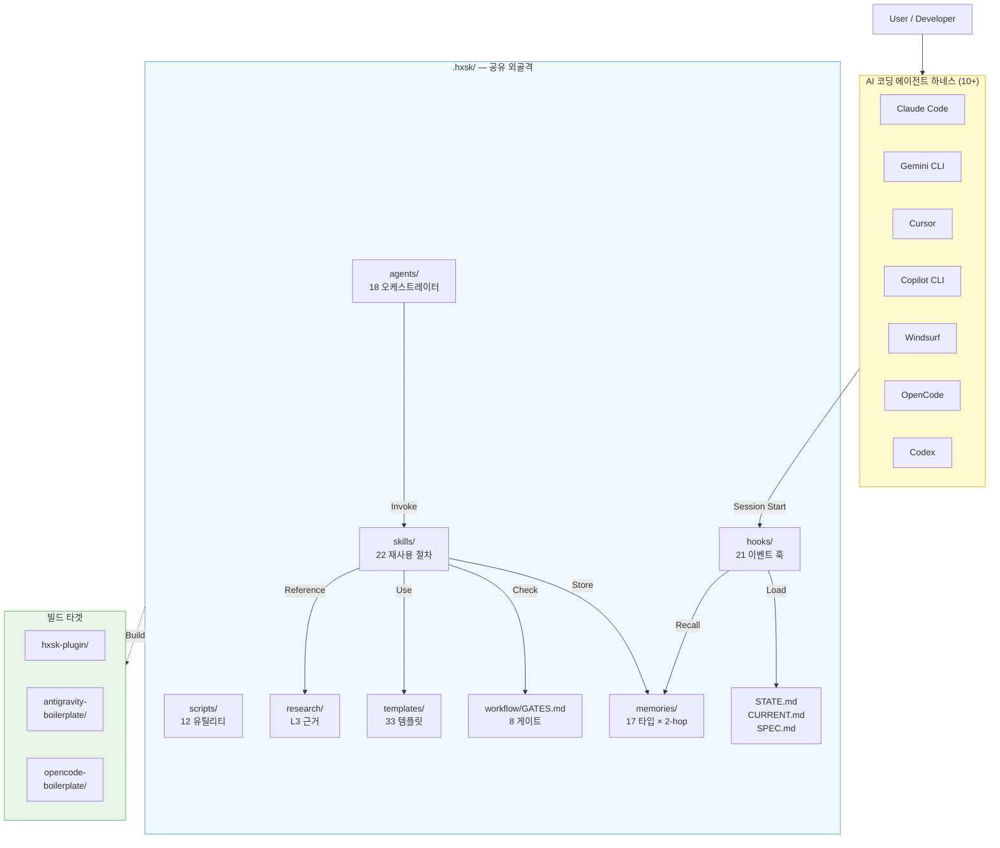
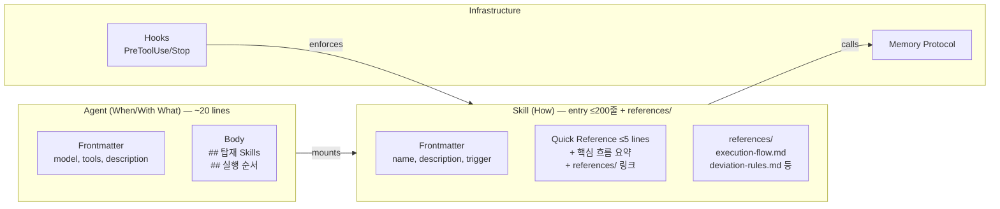
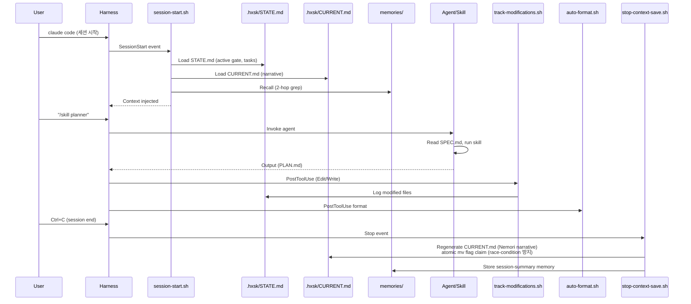
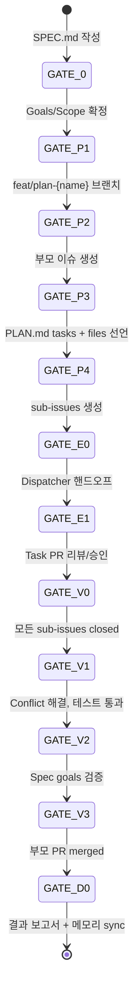
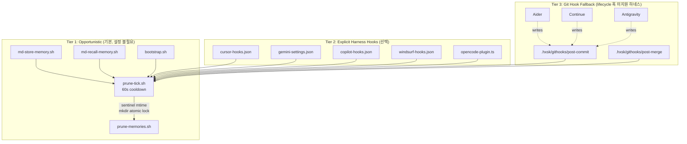
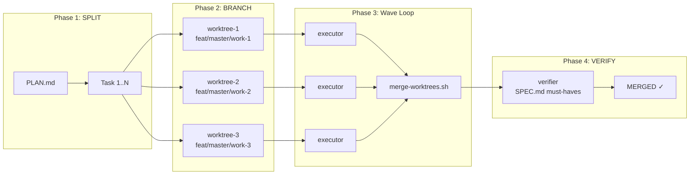
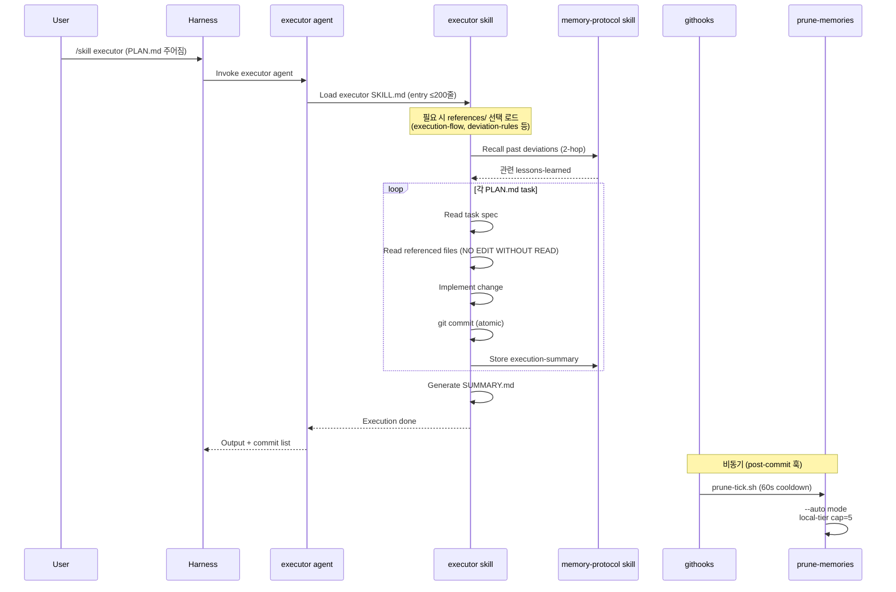
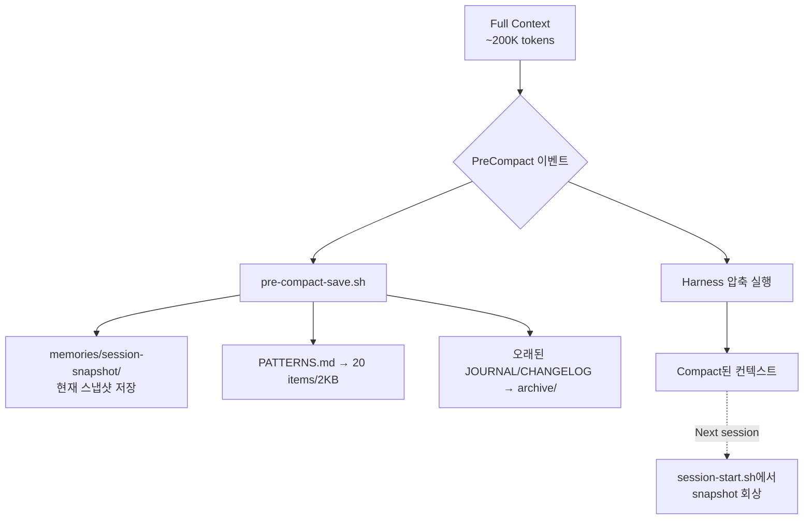

# System Architecture

> HExoskeleton의 컴포넌트 관계와 데이터 흐름.
>
> 수준: L1 공개 아키텍처 · 상세 ADR은 `.hxsk/DECISIONS.md` 참조

## 1. High-Level Component View



## 2. Agent-Skill Wrapping Pattern

HXSK는 **How / When-With-What** 분리 원칙을 엄격히 적용한다:



**크기 제약 (Progressive Disclosure — Phase 9)**:
- Agent body ≤ 20-30 lines (상세는 Skill에 위임)
- Skill Quick Reference ≤ 5 lines
- **Skill entry SKILL.md ≤ 200줄** (verifier/debugger ≤ 160줄)
- **Skill 상세는 `references/` 서브디렉토리로 분리** (선택 로드)
- CLAUDE.md ≤ 120 lines
- PATTERNS.md ≤ 2KB / 20 items

Phase 9 분할 결과: executor 681→98줄, planner 566→177줄, verifier 452→135줄, debugger 365→119줄 (~65-86% 절감).

근거: **SkillReducer 연구(2026)**는 48% 설명 압축 + 2.8% 품질 개선을 보고. **Anthropic 내부**는 시스템 프롬프트 ~1,800 tokens 최적, >2,500 tokens에서 34% 환각 증가를 관찰.

## 3. Session Lifecycle



## 4. Memory System (A-Mem + ReWOO + Nemori)

```mermaid
graph TB
    subgraph Store["저장 경로"]
        Agent[Agent action]
        Hook[Hook event]
        Agent --> MS[md-store-memory.sh]
        Hook --> MS
        MS -->|yaml_safe() sanitize<br/>YAML injection 방지| Safe[안전한 frontmatter]
        Safe -->|YAML frontmatter| File[memories/{type}/YYYY-MM-DD_{slug}.md]
        MS -->|TYPE_DIR auto-create| File
        MS -->|Nemori dedup| Skip{중복?}
        Skip -.Yes.-> Skipped[Skip write]
        Skip --No--> File
    end

    subgraph Recall["회상 경로"]
        Query[Query string]
        Query --> MR[md-recall-memory.sh]
        MR -->|grep| Idx1[1st hop: keywords, title]
        Idx1 --> Related[related field]
        Related -->|2-hop frontmatter 한정<br/>awk /^---$/| Idx2[2nd hop: 연관 메모리]
        Idx2 --> Result[Compact or Full 결과<br/>HXSK_RECALL_MAX 줄 제한]
        MR -->|결과 없음| NoMatch[[stderr: NO_MATCH]]
    end

    subgraph Prune["프룬 사이클"]
        Trigger[md-store or bootstrap 호출]
        Trigger --> PT[prune-tick.sh<br/>60s cooldown<br/>stale lock 300s 감지]
        PT -->|Lock OK| PM[prune-memories.sh --auto]
        PM -->|tier cap=5| Local[local tier 프룬]
        PM -->|value elevation| Shared[decision/root-cause<br/>→ shared tier]
    end

    File -.- Recall
    File -.- Prune
```

### A-Mem 필드 (각 메모리 파일의 frontmatter):
```yaml
---
name: short-title
type: root-cause | architecture-decision | ... (17 types)
keywords: [bug, auth, session-token]
contextual_description: "≤200자 요약 — 어떤 맥락에서 유용한가"
related: [slug-of-related-memory-1, slug-of-related-memory-2]
created: YYYY-MM-DD
---
```

### Tier 분리:
- **local/** — 세션 단기 메모리. gitignored. TTL + cap=5.
- **shared/** — 장기 지식. git 추적. 가치 태그(`decision`, `root-cause`, `architecture-decision`, `incident`) 보유 시 자동 승격.

## 5. Workflow Gates (SPEC → PLAN → EXECUTE → VERIFY → DONE)



게이트 조건 상세: `.hxsk/workflow/GATES.md`.

각 게이트는 `gate-check.sh`에 의해 검증되며, STATE.md에 기록된다.

## 6. Multi-Harness Adapter Pattern

HXSK는 Claude Code에 최적화되었지만 **10+ 하네스와 호환**된다. 핵심 설계는 "**opportunistic trigger + git fallback**":



**어댑터 드리프트 감지 및 동기화**:
- 드리프트 확인: `bash .hxsk/scripts/hxsk-harness-sync.sh --check`
- 동기화 적용: `bash .hxsk/scripts/hxsk-harness-sync.sh --sync`

**핵심 설계 결정 (DECISIONS.md)**: 외부 스케줄러(cron/launchd/systemd) 금지. `sentinel mtime + mkdir atomic lock`(BashFAQ/045)로 race condition 차단.

## 7. Dispatcher Wave 패턴 (병렬 실행)

5+ 독립 태스크가 있을 때 `dispatcher` skill이 활성화된다:



**규칙**:
- 같은 wave의 태스크는 동일 파일 수정 금지 (GATE-P3에서 검증)
- lockfile 수정 태스크는 `parallel: false` 필수
- 파일 소유권 선언 없이 병렬 작업 금지 (AGENTS.md Iron Law)

## 8. Build Pipeline (멀티 플랫폼)

```mermaid
graph LR
    Source[HExoskeleton 소스] --> BC[build-common.sh]
    BC --> BP[build-plugin.sh<br/>Claude Code]
    BC --> BA[build-antigravity.sh<br/>Antigravity IDE]
    BC --> BO[build-opencode.sh<br/>OpenCode]

    BP --> PathSub[${CLAUDE_PLUGIN_ROOT}<br/>경로 치환]
    BA --> PathSub
    BO --> PathSub2[OpenCode 경로 치환]

    PathSub --> PluginOut[hxsk-plugin/]
    PathSub --> AntigravOut[antigravity-boilerplate/]
    PathSub2 --> OCOut[opencode-boilerplate/]

    PluginOut -.GitHub Release.-> Artifact[hxsk-plugin-{ver}.zip]
```

**경로 전략(DECISION-001)**: `scripts/md-*.sh`는 `.hxsk/hooks/`의 심볼릭 링크. 빌드 시 `${CLAUDE_PLUGIN_ROOT}/scripts/`로 자동 치환되어 플러그인 환경에서도 동작.

## 9. Data Flow: "/skill executor" 실행 예시



## 10. Context Compaction Strategy

Claude Code가 컨텍스트 한계에 가까워지면 자동 압축을 트리거한다. HXSK는 이 순간을 **데이터 보존 기회**로 활용:



상세: `.hxsk/hooks/pre-compact-save.sh`, `compact-context.sh`.

## 11. Key Architectural Decisions

| ADR | 결정 | 근거 |
|-----|------|------|
| DECISION-001 | `scripts/md-*.sh`는 심볼릭 링크 | 빌드 시 경로 치환으로 플러그인/네이티브 양쪽 동작 |
| (미번호) | 외부 Vector DB 금지 | bash `grep`이 충분. zero-dep 원칙 |
| (미번호) | Opportunistic prune-tick | cron/launchd 의존 없이 cooldown 60s 자가 트리거; stale lock 300s 감지 |
| (미번호) | Tier 분리 (local/shared) | git 추적 비용 vs 장기 지식 보존 밸런스 |
| (미번호) | GATES.md 파일 기반 검증 | AGENTS.md의 "Forge-agnostic" 원칙 — GitHub 없어도 동작 |
| (미번호) | 17 memory types | A-Mem + 도메인 특화(debug/security/session/test) 혼합; `test` 타입은 PR #138에서 정식 추가 (16→17) |
| (미번호) | `.prune-config` owner+perm 검증 | 그룹/월드-쓰기 가능 config 소싱 시 WARN+스킵 — 권한 상승 방지 |
| (미번호) | `yaml_safe()` + 2-hop frontmatter 한정 | YAML injection 방지; body false-match 제거 |

전체 ADR: `.hxsk/DECISIONS.md`.

## See Also

- [Project Overview](project-overview-pdr.md) — Why / 원리
- [Codebase Summary](codebase-summary.md) — 파일 인벤토리
- [Code Standards](code-standards.md) — 컨벤션과 Iron Laws
- [Deployment Guide](deployment-guide.md) — 빌드 파이프라인 상세
- [Configuration Guide](configuration-guide.md) — 설정 키 레퍼런스
- `.hxsk/DECISIONS.md` — 전체 ADR 이력
- `.hxsk/research/memory-systems/` — A-Mem, Nemori, ReWOO 근거
