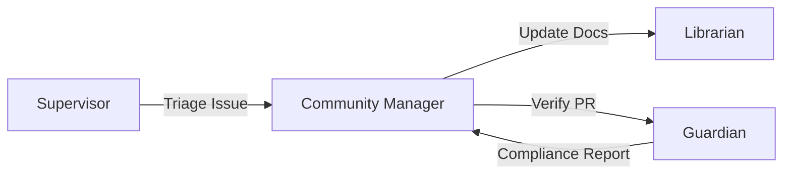

# Community Manager Skill

An AI agent skill for managing open-source community interactions, inspired by the `oh-my-opencode` Sisyphus agent.

## Purpose

This skill enables AI agents to:
1. **Triage Issues**: Analyze incoming issues, extract structured information, and route to appropriate maintainers
2. **Review PRs**: Perform automated PR checks for compliance with project standards
3. **Onboard Contributors**: Provide contextual guidance to new contributors
4. **Monitor Discussions**: Track community sentiment and surface important conversations

## Core Responsibilities

### 1. Issue Triage & Analysis

When invoked with an issue, the community manager should:

- **Extract Metadata**: Parse the issue template to validate all required fields are filled
- **Classify Type**: Determine if it's a bug, feature request, question, or discussion
- **Assess Priority**: Based on keywords, affected components, and user context
- **Suggest Labels**: Auto-generate relevant labels (e.g., `bug`, `enhancement`, `ai-agent`, `mcp`)
- **Initial Response**: Draft a welcoming comment acknowledging the issue

**Example Invocation:**
```bash
# From CLI
python langchain_tools/cli.py community-manager triage-issue <issue_number>

# Internally (from another agent)
from langchain_tools.tools.community_manager import IssueTriageTool
tool = IssueTriageTool()
result = tool._run(issue_number=123)
```

### 2. PR Review & Compliance

For pull requests, the agent should:

- **Check Contribution Guidelines**: Verify the PR follows `CONTRIBUTING.md` conventions
- **Validate Commits**: Ensure commit messages follow conventional commit format
- **Review Changes**: Surface potential issues (e.g., missing tests, breaking changes without docs)
- **Tone Check**: Ensure PR description is clear and respectful
- **CLAUDE.md Compliance**: Verify changes align with project's AI agent guidelines

**Hook Points:**
- `pre-pr-review`: Before detailed analysis
- `post-pr-review`: After generating feedback
- `pr-approval-check`: Before recommending approval

### 3. Onboarding Guidance

When a first-time contributor appears:

- **Welcome Message**: Send a personalized greeting
- **Context Injection**: Point to relevant documentation (`CONTRIBUTING.md`, `CLAUDE.md`, `README.md`)
- **Setup Help**: If the issue mentions setup problems, offer step-by-step guidance
- **Mentor Matching**: Suggest relevant maintainers or community members to contact

### 4. Knowledge Base Integration

Leverage the `Librarian` agent pattern to:

- **Record Common Patterns**: When issues reveal common problems, suggest updates to `CLAUDE.md`
- **Documentation Gaps**: Identify frequently asked questions and propose documentation improvements
- **Anti-Pattern Detection**: Flag violations of project conventions and suggest corrections

## Architecture

### Tools

The skill provides the following LangChain tools:

1. **`IssueTriageTool`**: Analyzes and classifies GitHub issues
2. **`PRReviewTool`**: Reviews pull requests for compliance
3. **`OnboardingGuideTool`**: Generates contextual onboarding messages
4. **`KnowledgeUpdateTool`**: Proposes updates to project knowledge bases

### Integration with Agent Graph

The community manager operates as a **background agent** that can be invoked by:

- **Supervisor**: When deciding how to handle external contributions
- **Librarian**: When updating documentation based on community feedback
- **Guardian**: When validating that PRs meet quality standards



### Hook System

Inspired by `oh-my-opencode`'s hook architecture, this skill can intercept:

- `issue.created`: Auto-triage new issues
- `pull_request.opened`: Run automated PR checks
- `discussion.created`: Monitor community discussions
- `issue.comment.created`: Respond to questions

**Example Hook Configuration:**
```json
{
  "hooks": {
    "issue.created": {
      "handler": "community_manager.triage_issue",
      "async": true,
      "priority": "high"
    },
    "pull_request.opened": {
      "handler": "community_manager.review_pr",
      "async": true,
      "priority": "medium"
    }
  }
}
```

## Usage Examples

### Example 1: Triaging a Bug Report

```python
from langchain_tools.agent.graph import graph

# Invoke the graph with a community management task
result = graph.invoke({
    "messages": [
        {
            "role": "user",
            "content": "Triage GitHub issue #42: User reports MCP server connection failures"
        }
    ]
})
```

**Expected Output:**
```markdown
## Issue Analysis

**Type**: Bug
**Priority**: High
**Component**: MCP Integration
**Labels**: `bug`, `mcp`, `needs-triage`

**Summary**: User experiencing connection failures with MCP servers. This appears related to Docker networking configuration.

**Suggested Actions**:
1. Ask for Docker logs (`docker logs <container_id>`)
2. Verify `.env.mcp` configuration
3. Check if this is related to known issue #38

**Draft Response**:
"Thank you for reporting this! MCP connection issues are often related to Docker networking. Could you please share:
- Your Docker version
- Output of `docker logs <mcp-container-name>`
- Contents of `.env.mcp` (with sensitive values redacted)

This will help us diagnose the issue faster."
```

### Example 2: Reviewing a PR

```python
from langchain_tools.tools.community_manager import PRReviewTool

tool = PRReviewTool()
review = tool._run(pr_number=15)
print(review)
```

**Output:**
```markdown
## PR Review: #15

**Compliance Check**: ✅ PASS

**Commits**:
- ✅ Uses conventional commit format
- ✅ Descriptive commit messages

**Changes**:
- ✅ No breaking changes
- ⚠️ Missing tests for new `CommunityManagerTool`
- ✅ Documentation updated in `README.md`

**Recommendations**:
1. Add unit tests for `CommunityManagerTool`
2. Consider adding integration test with GitHub API mocking

**CLAUDE.md Alignment**: ✅
Changes align with project's AI-native development philosophy.
```

## Implementation Guidelines

### For Developers

When implementing this skill:

1. **Use GitHub API**: Leverage PyGithub or Octokit for GitHub interactions
2. **Async Operations**: All GitHub API calls should be non-blocking
3. **Rate Limiting**: Respect GitHub API rate limits (use caching where possible)
4. **Error Handling**: Gracefully handle API failures and network issues
5. **Privacy**: Never expose sensitive information (API keys, user data)

### For AI Agents

When invoking this skill:

1. **Read `CONTRIBUTING.md` first**: Understand project standards before triaging
2. **Check `CLAUDE.md`**: Ensure responses align with project's AI philosophy
3. **Be Respectful**: Always use welcoming, constructive language
4. **Verify Context**: Don't assume—ask for clarification when ambiguous
5. **Record Learnings**: Update knowledge bases when discovering patterns

## Configuration

Create a `.community-manager.json` in the project root:

```json
{
  "github": {
    "token": "${GITHUB_TOKEN}",
    "repo": "SukbeomH/LLM_Bolierplate_Pack",
    "auto_label": true,
    "auto_respond": false
  },
  "triage": {
    "priority_keywords": {
      "high": ["crash", "data loss", "security"],
      "medium": ["bug", "error", "failure"],
      "low": ["enhancement", "documentation", "question"]
    }
  },
  "pr_review": {
    "require_tests": true,
    "require_docs": true,
    "enforce_conventional_commits": true
  }
}
```

## Future Enhancements

- **Multi-Language Support**: Auto-detect and respond in contributor's language
- **Sentiment Analysis**: Monitor community health via sentiment tracking
- **Automated Merges**: Auto-approve PRs that pass all checks (with safeguards)
- **Contributor Stats**: Generate contribution reports and recognition posts
- **Integration with Sisyphus**: Use delegated agents for complex triage tasks

## References

- [oh-my-opencode Agent System](https://deepwiki.com/code-yeongyu/oh-my-opencode/4-agent-system)
- [Hook System Pattern](https://deepwiki.com/code-yeongyu/oh-my-opencode/7-hook-system)
- [GitHub REST API Documentation](https://docs.github.com/en/rest)
- [Conventional Commits](https://www.conventionalcommits.org/)
